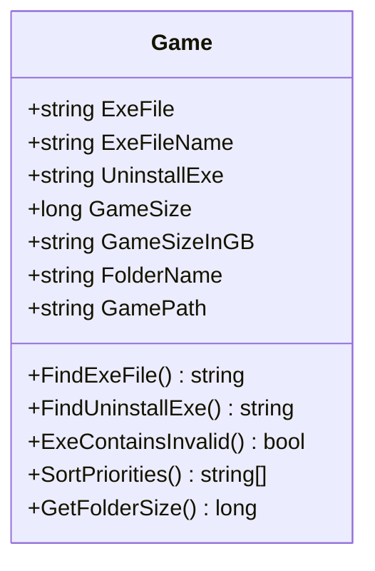
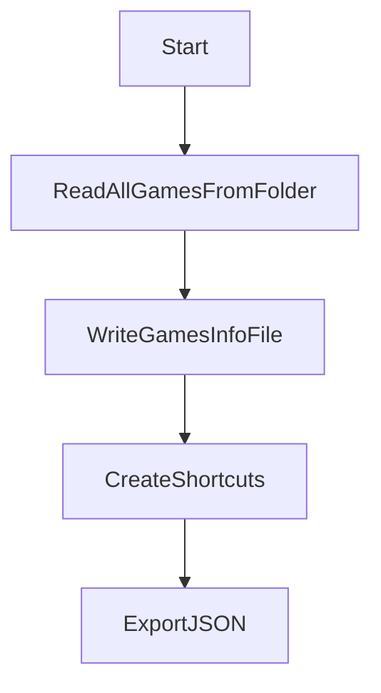
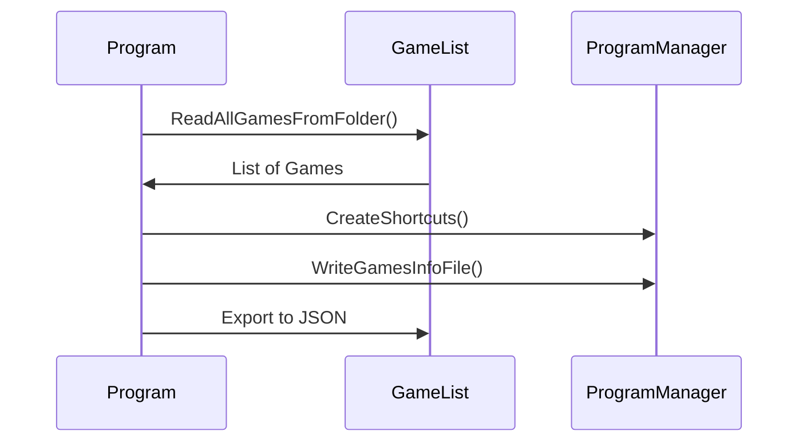

# 🎮 Game Manager - Dokumentation


## Inhaltsverzeichnis
1. [📌 Übersicht](#-übersicht)
2. [⚙️ Funktionsweise](#️-funktionsweise)
   - [🎯 Game-Klasse](#-game-klasse)
   - [📋 GameList-Klasse](#-gamelist-klasse)
   - [🛠️ ProgramManager-Klasse](#️-programmanager-klasse)
   - [🚀 Hauptprogramm](#-hauptprogramm)
3. [📥 Installation und Verwendung](#-installation-und-verwendung)
4. [🔧 Technische Details](#-technische-details)
5. [📊 Beispielkonfiguration](#-beispielkonfiguration)
6. [✨ Erweiterungsmöglichkeiten](#-erweiterungsmöglichkeiten)

## 📌 Übersicht

Der Game Manager ist eine C#-Anwendung, die entwickelt wurde, um eine Sammlung von PC-Spielen zu verwalten. Die Hauptfunktionen umfassen:

- 🔍 Automatische Erkennung von Spielen in festgelegten Verzeichnissen
- 📌 Erstellung von Desktop-Verknüpfungen für alle gefundenen Spiele
- 💾 Berechnung der Speichergröße jedes Spiels
- 🗑️ Bereitstellung von Deinstallationsmöglichkeiten
- 📄 Generierung einer Übersichtsdatei mit allen Spielinformationen
- 📦 JSON-Export der Spieledaten

## ⚙️ Funktionsweise

### 🎯 Game-Klasse



Die `Game`-Klasse ist das Kernstück der Anwendung und repräsentiert ein einzelnes Spiel.

**Wichtige Eigenschaften:**
- `ExeFile`: Pfad zur ausführbaren Datei des Spiels
- `ExeFileName`: Name der ausführbaren Datei (ohne Erweiterung)
- `UninstallExe`: Pfad zur Deinstallationsdatei (falls vorhanden)
- `GameSize`: Größe des Spielordners in Bytes
- `GameSizeInGB`: Formatierte Größe in Gigabyte
- `FolderName`: Name des Spielordners (mit bereinigten Sonderzeichen)
- `GamePath`: Pfad zum Spielordner

### 📋 GameList-Klasse



### 🛠️ ProgramManager-Klasse

### 🚀 Hauptprogramm



## 📥 Installation und Verwendung

### Ordnerstruktur-Empfehlung

Für optimale Ergebnisse organisieren Sie Ihre Spiele in Unterordnern nach Plattformen/Herausgebern:

```
D:\Games
├── Epic Games
│   ├── HorizonZeroDawn
│   ├── FarmingSimulator22
│   └── AmongUs
├── EA Games
│   ├── FIFA23
│   └── Battlefield2042
└── PC Games
    ├── DOOM
    └── ELDEN RING
```

**Wichtig:** Jedes Spiel sollte in einem eigenen Unterordner liegen!

### Konfigurationsbeispiel

```csharp
// In Program.cs anpassen:
string sourcePath = "D:\\Games";          // Hauptspieleordner
string sourcePath2 = "D:\\SteamLibrary\\steamapps\\common"; // Steam-Ordner
string[] ignoreFolders = { "backup", "temp", "cache" }; // Zu ignorierende Ordner
```

## 🔧 Technische Details

### EXE-Erkennungslogik

1. Sammelt alle .exe-Dateien
2. Filtert ungültige Dateien (unins, setup, etc.)
3. Sortiert nach Priorität (run, EU, launcher)
4. Wählt die erste passende EXE

## 📊 Beispielkonfiguration

```json
{
  "Games": [
    {
      "ExeFile": "D:\\Games\\Epic Games\\HorizonZeroDawn\\HorizonZeroDawn.exe",
      "FolderName": "HorizonZeroDawn",
      "GameSizeInGB": "72.23 GB"
    },
    {
      "ExeFile": "D:\\Games\\Steam\\AoT2\\AOT2_EU.exe",
      "FolderName": "AoT2",
      "GameSizeInGB": "39.82 GB"
    }
  ],
  "GameSizeGB": "848.16 GB"
}
```

## ✨ Erweiterungsmöglichkeiten

1. **Platform Icons**: Erkennung und Anzeige von Plattform-Icons
2. **Auto-Update**: Automatische Aktualisierung der Spieledaten
3. **Multi-User**: Unterstützung mehrerer Benutzerprofile
4. **Cloud Sync**: Synchronisation mit Cloud-Speicher

---

🛠️ **Hinweis zur Ordnerstruktur:**  
Für beste Ergebnisse sollten Spiele in Unterordnern nach Plattformen organisiert werden (z.B. "Epic Games", "EA Games", "Steam"). Innerhalb dieser Plattform-Ordner sollte jedes Spiel seinen eigenen Ordner haben. Der Game Manager durchsucht diese Struktur rekursiv und erkennt Spiele in beliebiger Tiefe.

Beispiel:
```
D:\Games
└── Epic Games
    └── HorizonZeroDawn
        ├── Binaries
        ├── Content
        └── HorizonZeroDawn.exe
```

Diese Struktur hilft bei:
- Übersichtlicher Organisation
- Vermeidung von Namenskonflikten
- Einfacherem Backup und Management
- Plattformspezifischen Operationen (z.B. Epic-Manifest-Bereinigung)
